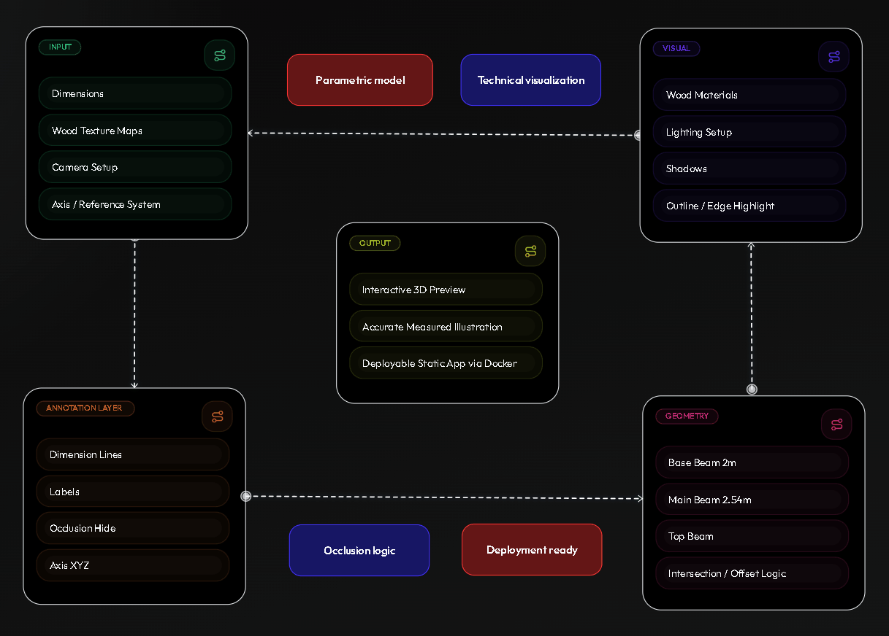

# 3D Timber Illustration



A Three.js technical visualization project that renders a timber beam composition with measured dimensions, wood materials, axis references, and presentation-focused camera framing.

## Live Demo

[View Live Demo](https://test-three.raishannan.com)

[View Video](https://drive.google.com/file/d/1MuYabteEp97P4jMyTsRXCVGci1Wxpy5s/view?usp=drive_link)

## Highlights

- Parametric beam modeling driven by configurable dimensions and offsets
- Technical visualization with dimension lines, markers, labels, and XYZ reference axes
- Occlusion-aware labels that hide automatically when blocked by geometry
- Modular architecture for scene core, materials, and annotation logic
- Smooth camera framing for a more polished presentation
- Docker-ready deployment for static production serving

## Tech Stack

- Three.js
- Vite
- Docker
- Nginx

## Project Structure

- [js/illustration/illustration-three.js](js/illustration/illustration-three.js)
  Entry point that assembles geometry, dimensions, camera framing, and scene flow
- [js/illustration/modules/SceneCore.js](js/illustration/modules/SceneCore.js)
  Renderer, camera, controls, lighting, shadows, and axis system
- [js/illustration/modules/WoodMaterials.js](js/illustration/modules/WoodMaterials.js)
  Wood texture loading and material generation
- [js/illustration/modules/DimensionSystem.js](js/illustration/modules/DimensionSystem.js)
  Dimension lines, labels, markers, and occlusion handling
- [model/wood](model/wood)
  Texture assets for the timber material system

## Visual Pipeline

1. Dimension constants define the beam sizes and offsets.
2. Geometry is generated for the lower beam, main beam, and top beam.
3. Wood materials are applied using texture and normal maps.
4. Dimension overlays and markers are attached to key measurement points.
5. Lighting, shadows, axis references, and camera framing complete the presentation layer.

## Local Development

Install dependencies:

```bash
npm install
```

Start the dev server:

```bash
npm run dev
```

Open the URL shown by Vite, usually:

```text
http://localhost:5173
```

## Production Build

Build the app:

```bash
npm run build
```

Preview the production build locally:

```bash
npm run preview
```

## Docker

Build the Docker image:

```bash
docker build -t candidate-test .
```

Run the container:

```bash
docker run --rm -p 8080:80 candidate-test
```

Open:

```text
http://localhost:8080
```
