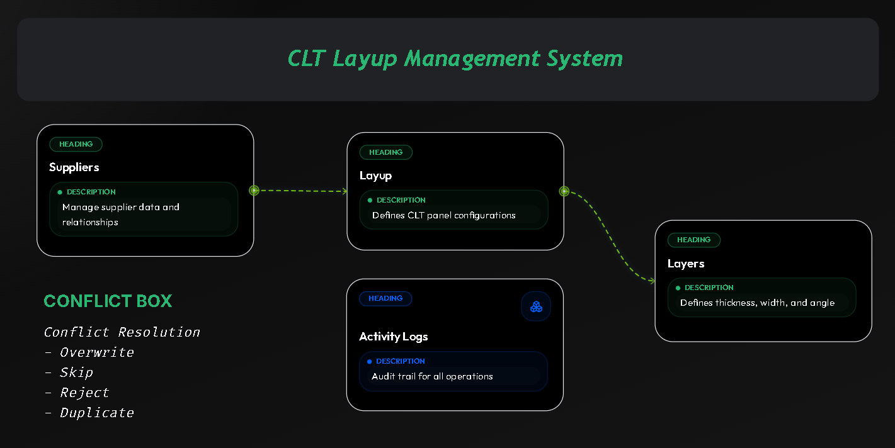

<div align="center">
  
  
  # 🌲 CLT Manager (Candidate Test)
  
  **Enterprise-Grade Timber Management System**
  
  *Submitted by **Rais Hannan** as a Feature Test Assignment.*

[]()
[]()
[]()
[]()
[]()

<br>

**[🌐 View Live Demo](https://test-cli.raishannan.com/)**
**[🌐 View Video](https://drive.google.com/file/d/1D-nGyukkNvEdmxH69b-W8Vu9wM-xPzCC/view?usp=drive_link)**

</div>

---

### 📖 Overview

**CLT Manager** is a robust, full-stack solution built to manage the complex hierarchy of **Cross-Laminated Timber (CLT)** production. From suppliers to technical layer specifications, every data point is versioned, validatable, and visually resolved.

---

### ✨ Core Capabilities

#### 🏗️ Architecture Excellence

- **Hierarchy-First Design**: Strict `Supplier → Layup → Layer` relational enforcement.
- **Repository & Service Pattern**: Clean abstraction of data access and business rules.
- **2-Phase Import Engine**: Secure "Scan & Commit" workflow with manual conflict resolution.
- **Dark Enterprise UI**: Premium dark-mode aesthetics with glassmorphism and smooth micro-interactions.

#### 🛠️ Technical highlights

- **Diff Engine**: Real-time visual comparison (Existing vs. Incoming) for JSON imports.
- **Activity Tracking**: Comprehensive event logging for all CRUD and Batch operations.
- **Snappy UX**: SPA-style navigation powered by PJAX-like DOM hydration and sessionStorage caching.
- **API Engine**: Unified trait-based JSON responses with automatic pagination meta-data.

---

### 🔌 API Reference

| Endpoint                                | Method           | Description                                      |
| :-------------------------------------- | :--------------- | :----------------------------------------------- |
| **Suppliers**                           |                  |                                                  |
| `/api/v1/suppliers`                     | `GET` / `POST`   | List all suppliers or create a new one           |
| `/api/v1/suppliers/{id}/show`           | `GET`            | Get single supplier details                      |
| `/api/v1/suppliers/{id}/export`         | `GET`            | Export supplier + children to JSON               |
| `/api/v1/suppliers/{id}/import/scan`    | `POST`           | Dry-run scan for JSON data (Conflicts detection) |
| `/api/v1/suppliers/{id}/import/confirm` | `POST`           | Commit scanned data with resolution strategy     |
| **Layups**                              |                  |                                                  |
| `/api/v1/layups/{supplier_id}`          | `GET`            | List all layups for a specific supplier          |
| `/api/v1/layups`                        | `POST`           | Create a new layup                               |
| `/api/v1/layups/{id}/show`              | `GET`            | Get layup details                                |
| `/api/v1/layups/{id}/update`            | `PATCH`          | Update layup information                         |
| **Layers**                              |                  |                                                  |
| `/api/v1/layers/{supplier}/{layup}`     | `GET`            | List all layers for a layup                      |
| `/api/v1/layers`                        | `POST`           | Create a new layer                               |
| `/api/v1/layers/{id}/show`              | `GET`            | Get layer specifications                         |
| `/api/v1/layers/{id}/update`            | `PUT`            | Update layer thickness, width, or angle          |
| **System**                              |                  |                                                  |
| `/api/v1/activity-logs`                 | `GET`            | Retrieve Paginated Audit Logs                    |

---

### 🚀 Getting Started

Follow these steps to initialize the environment locally:

#### 1. Repository Setup

```bash
git clone https://github.com/vierohanz/candidate-test.git
cd candidate-test
git checkout raishannan-assignment
```

#### 2. Dependency Management

```bash
composer install
npm install
```

#### 3. Configuration & Database

```bash
cp .env.example .env
php artisan key:generate

# Set your DB_CONNECTION in .env then run:
php artisan migrate --seed
```

#### 4. Launching the App

```bash
# Terminal 1
php artisan serve

# Terminal 2
npm run dev
```

---

### 🧪 Quality Assurance

We maintain high standards through rigorous automated testing.

```bash
# Execute full test suite
php artisan test
```

| Suite                 | Focus                               |
| :-------------------- | :---------------------------------- |
| **SupplierTest**      | Root level CRUD & Export logic      |
| **CltLayupTest**      | Nested hierarchy & Validation       |
| **CltLayerTest**      | Order sequence & Technical specs    |
| **ImportServiceTest** | Dry-run logic & Conflict strategies |

---

### 🎯 Submission Context

- **Live Demo**: [test-cli.raishannan.com](https://test-cli.raishannan.com/)
- **Collaborators**: @ikhsan017, @dhiaaziz
- **Focus**: Scalability, Data Integrity, and Premium User Experience.

---

<div align="center">
  <sub>Built with ❤️ for the Feature Test Assignment.</sub>
</div>
